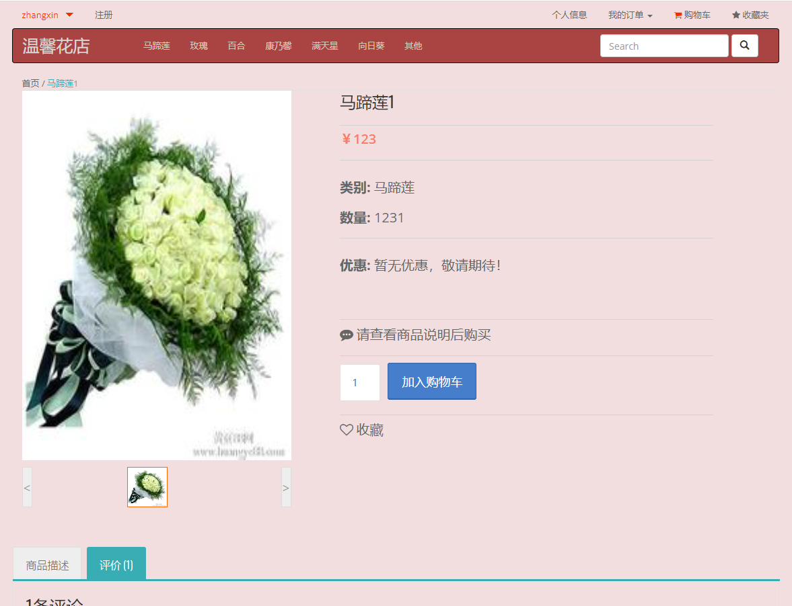
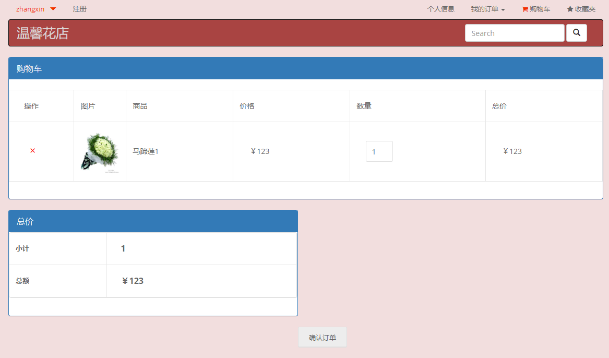
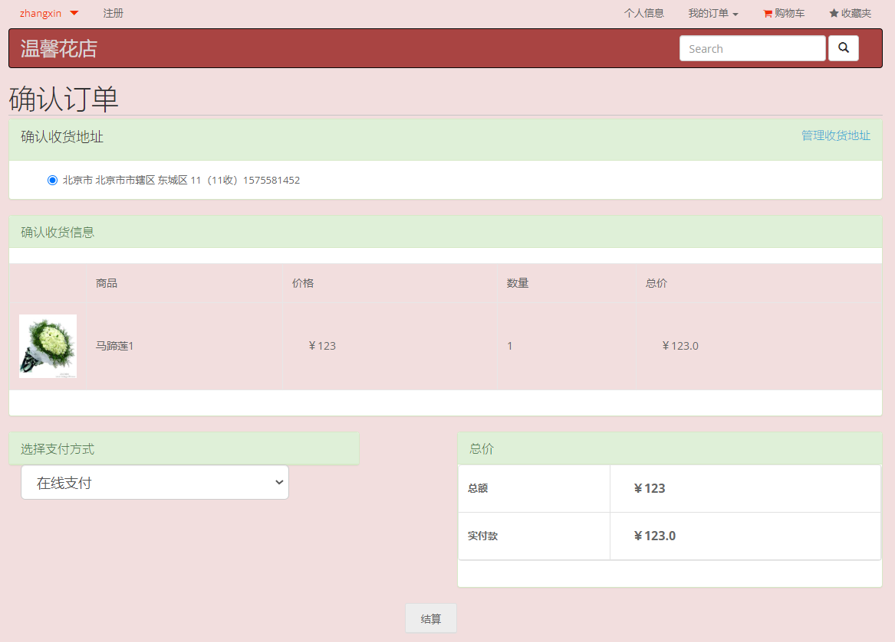
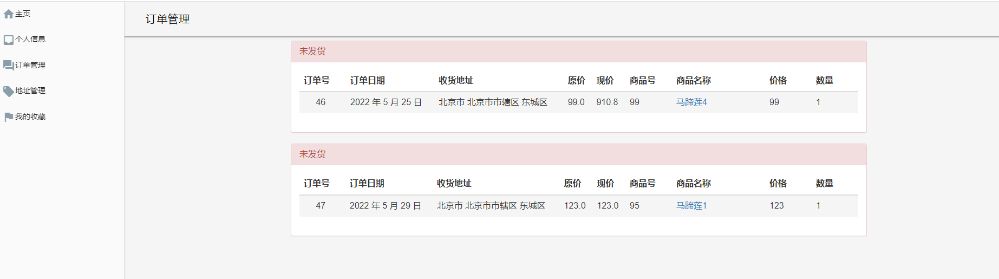
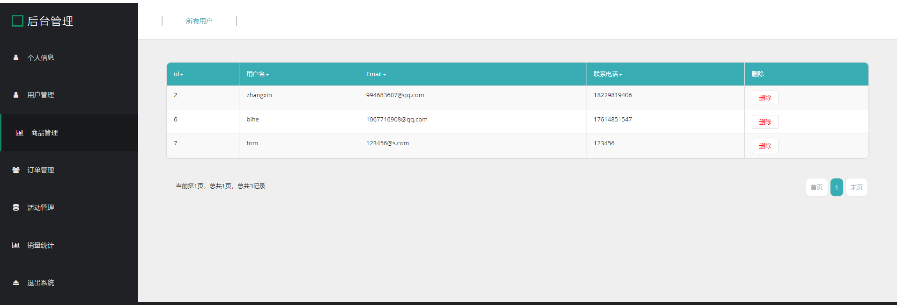
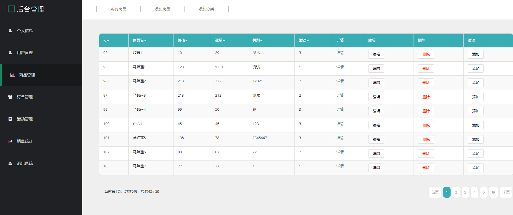
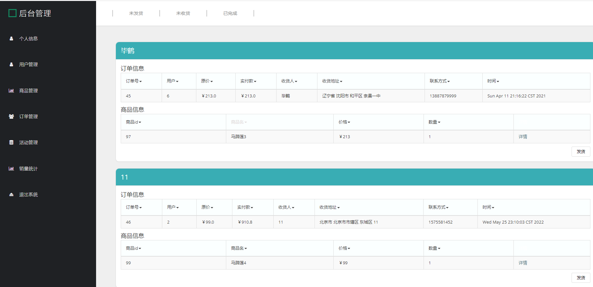
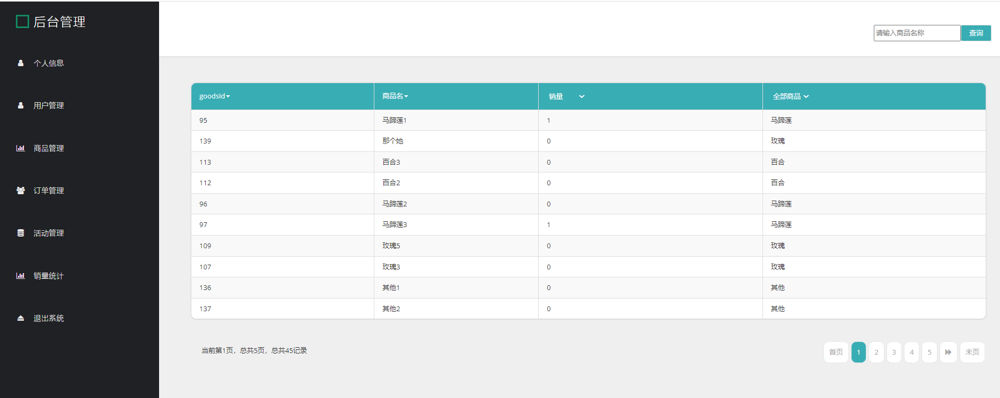

**需要完整代码可以加qq  931708230 或者加微信 ynwwxid**

**需要完整代码可以加qq  931708230 或者加微信  ynwwxid**

**博客地址：[https://blog.csdn.net/2303_76227485/article/details/128650067](https://blog.csdn.net/2303_76227485/article/details/128650067)**

**视频演示：[https://space.bilibili.com/384537280](https://space.bilibili.com/384537280)**

**毕业设计所有选题地址：[https://github.com/ynwynw/allProject](https://github.com/ynwynw/allProject)**

## JAVA毕业设计—基于Springboot  网上花店商城(源代码+数据库+课程设计报告)

## 一、系统介绍

- 包括管理员、普通用户两种角色，外加游客(未登录情况)

  权限  游客 < 普通用户 < 管理员

  1、游客功能

  查看鲜花信息

  2、普通用户功能

  购买鲜花、订单管理、地址管理

  个人信息修改、密码修改，登录登出

  3、管理员功能

  用户管理、地址管理、鲜花管理、订单管理

  个人信息、密码修改、销量统计

## 二、所用技术

后端技术栈：

- springboot
- mybatis-plus
- mysql

前端技术栈：

- jsp 
- bootstrap 

## 三、环境介绍

基础环境 :IDEA/eclipse, JDK 1.8, Mysql5.7及以上,Maven

所有项目以及源代码本人均调试运行无问题 可支持远程调试运行

## 四、页面截图

## 五、浏览地址

前台地址

http://localhost:8093/shop/

账号密码 zhangxin   123456

后台地址-管理员登录

http://localhost:8093/shop/admin/login

账号密码 admin 123456

## 六、安装教程

1. 使用Navicat或者其它工具，在mysql中创建对应名称的数据库，并导入项目的sql文件；
2. 使用IDEA/Eclipse导入项目，若为maven项目请选择maven;若为maven项目，导入成功后请执行maven clean;maven install命令，然后运行；
3. 修改application.yml 里面的数据库配置
4. 启动项目后端项目 
5. 访问浏览地址

**需要完整代码可以加qq  931708230 或者加微信 ynwwxid**

**需要完整代码可以加qq  931708230 或者加微信  ynwwxid**
